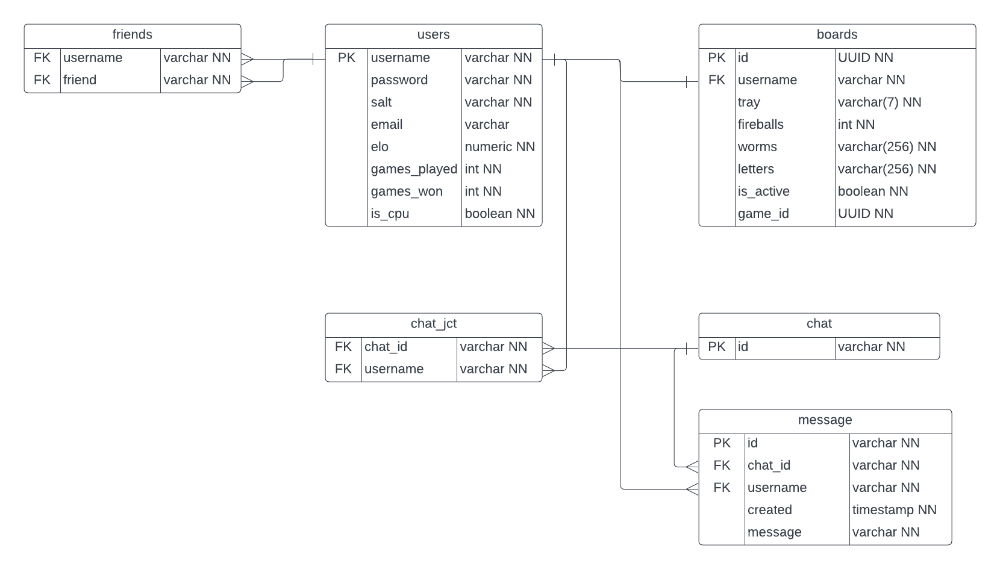

# WordsAway-V2-Backend

<a href="https://github.com/220808-Java-React-Enterprise/WordsAway-P3-Frontend">Frontend</a>

## Team Members
#### Leads
- Delane Green (SCRUM Master)
- Chris Waters (Backend Lead)
- Manuel Lopez (Frontend Lead)
- Will Smith (DevOps Lead)
#### Backend
- Robert James
- Chuong Nguyen
#### Frontend
- Nicholas Fielder
- Jon Mikael Transfiguration
- Melissa Clark
- Leighton Albrecht
- Todd Kirby
#### DevOps
- Nathan Gilbert
- Emir Kaynak

## Proposal
Words Away V2 is a Social Media application centered on everyone's favorite game Word Away. Make friends, view user profiles, hang out in persistent chat rooms, and on top of all that, play a game of Words Away. V2 will add social media aspects to the Words Away digital board game. Additionally, the game will be polished and given a facelift, the user experience smoothed out, and quality of life features will be added.

## Features
- Players can register with a username, email, and password.
- Players will be able to start a game with a CPU.
- Players are able to start a game with another user
- Each player has a “tray” of 7 letters that they can make words from.
- Each time a letter is played, a new letter is drawn to replace it.
- A player can skip their turn to shuffle their letters back in and receive 7 new letters.
- A player can play a fireball if they have one instead of a word.
- Once all the opponent’s worms have been destroyed, the remaining player is the winner.
- Letters will have a rarity value that when played activates special effects.
- Users can view other players profiles which displays information like gaming history, ranking information, and friends.
- Users can view an overall leaderboard or friend leaderboard.
- Users can chat with friends or opponents.

## Rules

## Game Link
<a href="http://words-away.s3-website.us-east-2.amazonaws.com">Words Away</a>

## Tech Stack
- TBD

## MVP
- All V1 feature still functional
- Each User has a profile that can be viewed and displays relevant information
- Notification of being challenged and lobby shows if it's your turn
- Users can make friend requests and manage a friends list
- User can chat anywhere in the app
- Users have customizable wizard avatars
- Viewable leaderboard that can also be filtered to a user's friends
- Rules breakdown / rules page
- No major bugs and smooth user experience

## Stretch Goals
- User profile/leaderboard
- AI difficulty options.
- Allow user to place worms
- Notify user of destroyed worm
- Update appearance of webpage
- Player Communication
- Notify user of turn
- Profile Viewing
- Tutorial
- Mobile Support

## ERD

## Contributors
#### Leads
- Delane Green (SCRUM Master)
  - TBD
- Chris Waters (Backend Lead)
  - TBD
- Manuel Lopez (Frontend Lead)
  - TBD
- Will Smith (DevOps Lead)
  - TBD
#### Backend
- Robert James
  - TBD
- Chuong Nguyen
  - TBD
#### Frontend
- Nicholas Fielder
  - TBD
- Jon Mikael Transfiguration
  - TBD
- Melissa Clark
  - TBD
- Leighton Albrecht
  - TBD
- Todd Kirby
  - TBD
#### DevOps
- Nathan Gilbert
  - TBD
- Emir Kaynak
  - TBD
